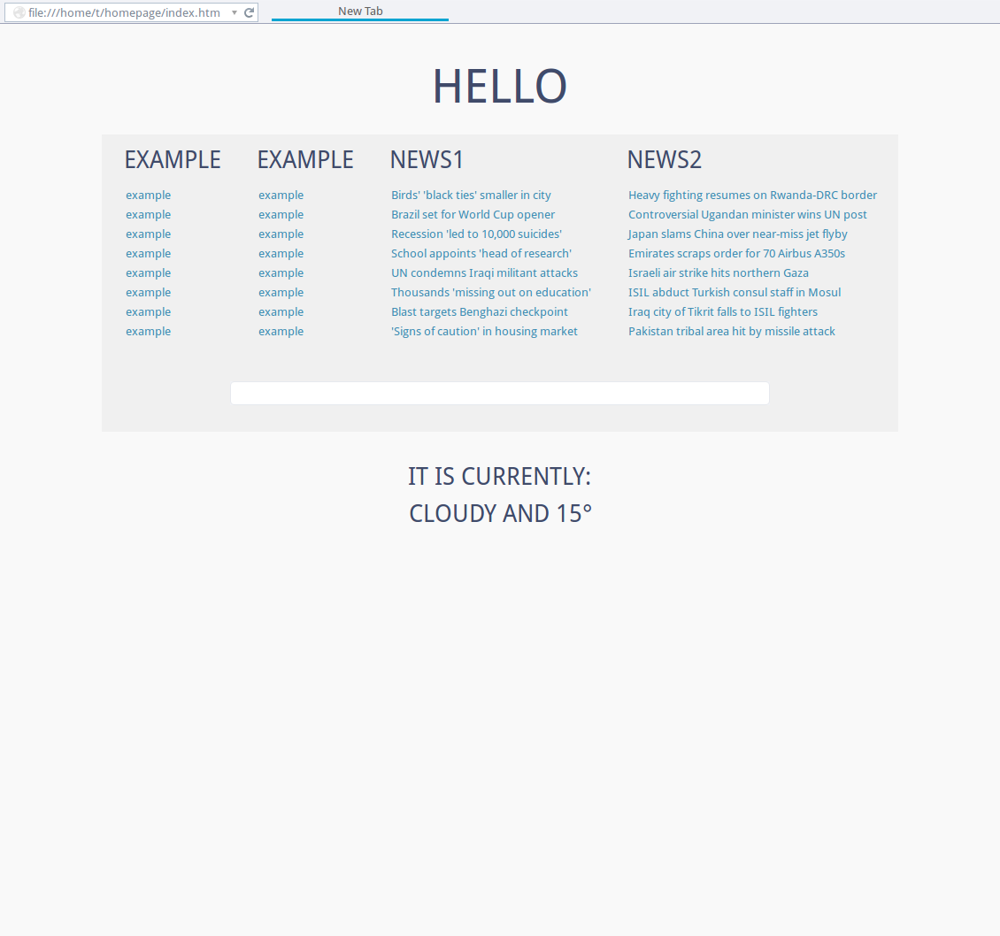

homepage
========

homepage for firefox

license:
wtfpl http://www.wtfpl.net/

deps:
python
feedparser: https://pypi.python.org/pypi/feedparser if you want rss
pywapi: https://pypi.python.org/pypi/pywapi/0.2.2 if you want weather

use:
edit example.py, run it and it will generate an html file
the file is static, no javascript because I hate it
if you want rss/weather to update make a cron job or something

example screenshot:

